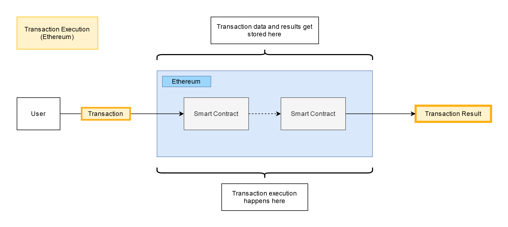
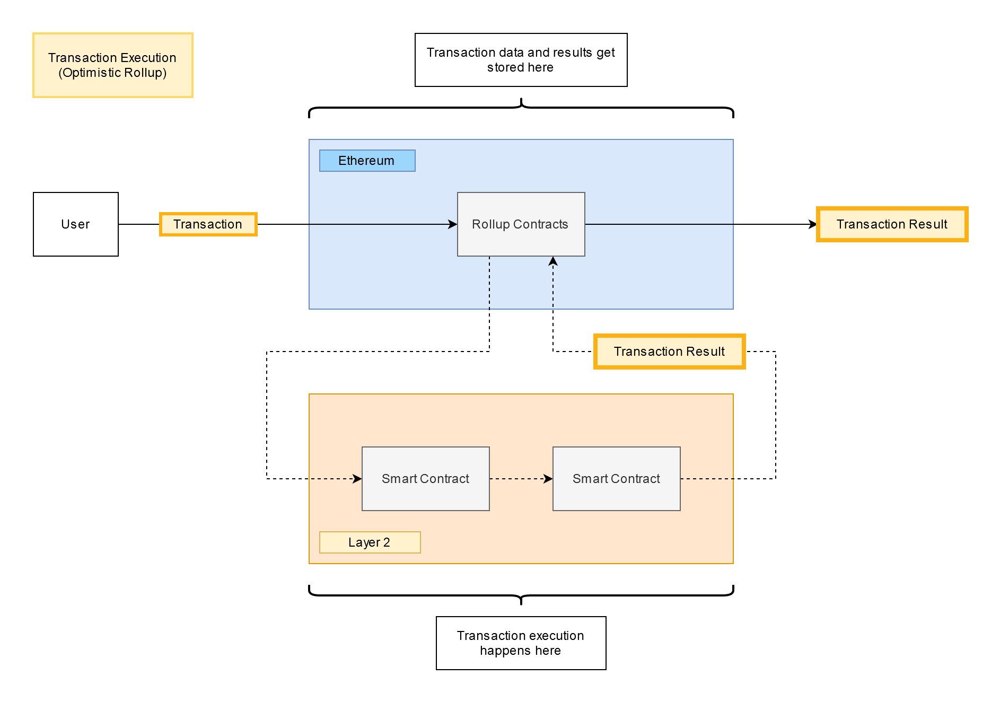

# {{ $frontmatter.title }}

## Understanding the Problem
We're going to kick this documentation off by taking a high-level look at the problem that the Optimistic Rollup construction attempts to solve. Fundamentally, "rollup"-style designs try to make Ethereum transactions cheaper by decoupling the platform's two primary roles: storing information and running computations based on that information. Just like any other computer, Ethereum becomes useful because it can transform information via the software it runs. However, unlike most other computing systems, Ethereum doesn't just run on a single machine. Any computation performed on Ethereum is replicated by every node on the Ethereum network. This property makes it essentially impossible for nodes to lie about the result of a transaction, but it also inherently increases the cost of each transaction. Generally speaking, the more machines that have to run a piece of code, the more a user needs to pay to have that code run.

Code execution makes up one half of the formula that defines the cost of an Ethereum transaction, input data attached to the transaction makes up the other half. Every Ethereum transaction contains information that tells the network what changes the transaction is attempting to make. Contract deployment transactions contain contract code, contract interactions contain relevant information like the address of the contract you're interacting with. From this information alone we're able to compute the current state of Ethereum. However, data storage is relatively cheap -- input data only accounts for a small fraction of the total cost of the average Ethereum transaction. If we can reduce the amount of code execution a transaction has to do on Ethereum, then we can disproportionately cut the cost of that transaction. Optimistic Rollup tries to do exactly this.

## Cutting Transaction Costs
In short, Optimistic Rollup cuts costs by executing Ethereum transactions *outside* of Ethereum itself. Let's explain this visually. 

In Ethereum, transaction input data is posted publicly and nodes all execute the transaction in order to compute some result.

In an Optimistic Rollup, transaction input data is still posted publicly but transactions are only executed by a smaller set of "Layer 2" nodes. One of these nodes then publishes the result of this transaction back onto Ethereum.

This second flow is cheaper than the standard Ethereum flow, concretely, because the number of machines actually running complex code is greatly reduced.

## The Advent of Fraud
Running a computation on Layer 2 comes with one major caveat. As Ethereum hasn't actually performed the computation itself, users need some guarantees that Layer 2 nodes are publishing the correct transaction results. If we simply used the system described above, any Layer 2 node could publish a fraudulent transaction result. For instance, a Layer 2 node could lie about the recipient of an ERC20 transfer transaction. Let's visualize this:

[diagram]

Ethereum isn't running this transfer, it's only storing the transaction data and the eventual transaction result. Without some sort of mechanism that prevents this "fraudulent" behavior, Layer 2 nodes could easily steal assets from users of the Optimistic Rollup chain. Obviously this isn't very ideal.

All "rollup"-style Layer 2 systems have to deal with this problem. Most of the differences between various rollup constructions can be found in the strategy they employ to handle fraud. One possible solution comes in the form of "moon math," complex cryptography that ensures any transaction results published to Ethereum were, in fact, the correct result. However, this solution often comes at the cost of limiting the type of applications a user can deploy to the Layer 2 chain. Developers on these sorts of platforms will usually have to build their applications around the restrictions of the "proof system," a task which typically requires rewriting existing Solidity code in a new programming language. We feel this creates a barrier to entry that inherently caps the accessibility of Layer 2, at least until these solutions have progressed to the point of being able to run arbitrary Solidity code.

In the absence of "fancy crypto," the only way for Ethereum to determine the correctness of some execution is, well, to run the execution itself. Of course, we don't want to have to run *every* execution on Ethereum or we wouldn't capture the cost savings of *not* running the execution on Ethereum. We instead want to design a system that allows users to "challenge" the validity of some published result. In essence, users need to be able double-check an L2 transaction on Ethereum if they believe the published result was fraudulent. If the result computed by Ethereum differs from the published one, then we reward the users who helped reveal fraud, punish the user who submitted the bad result, and delete the bad result so that a correct one can be published in its place.

[diagram]

It's important to note that only **transaction results** can be fraudulent, not the **transactions** themselves. If a transaction result is shown to be fraudulent, the corresponding transaction remains untouched so that a new, correct result can be published instead. However, we still want to avoid a situation in which a significant number of transaction results are reverted and need to be recomputed. In order to guarantee a sense of finality, we require that a fraudulent result be detected and invalidated within a certain period of time after its publication (known as the **fraud proof window**). Under the assumption that Ethereum is accepting transactions, a reasonable fraud proof window on the order of ~7 days is sufficient to ensure that any fraudulent results will be detected and challenged. Once a result has passed its fraud proof window, we can safely assume that the result is valid.

As ever, the devil is in the details here. Access to Ethereum state could allow a contract to change its behavior depending on whether it's running on Layer 1 or on Layer 2, a clear source of non-determinism. We describe the mechanisms used to enforce deterministic execution in significantly more detail within our System Architecture Deep Dive. 

## Moving Between Layer 1 and Layer 2
Developers with existing applications on Layer 1 might want to move assets to (or from) Layer 2. Although we provide native functionality that simplifies this process, it's useful to understand the exact manner in which this information transfer occurs. Given the differences between Layer 1 and Layer 2, we follow slightly different protocols for each direction.

All information transfer from Layer 1 to Layer 2 takes the form of a simple rollup transaction. Contracts and users can both create rollup transactions that directly interact with contracts on Layer 2. For instance, an ERC20 contract on Ethereum might want to be able to transfer funds to a corresponding ERC20 contract on Layer 2. One could achieve this by burning the tokens on Ethereum and sending a "mint" transaction to the contract on Layer 2. All Layer 2 transactions can access an "L1 message sender" field in order to authenticate these cross-domain interactions. Here's a visualization of this example:

[diagram]

Information transfer from Layer 2 to Layer 1 is essentially identical to the process described above, with the added caveat that contracts on Layer 1 should wait for the fraud proof window to expire before accepting the given transaction.

[diagram]

Given some of the complexity inherent in this process, we provide two utility contracts, the `OVM_L1CrossDomainMessenger` and the `OVM_L2CrossDomainMessenger`, which automatically handle the checks needed to assert the validity of an incoming message. We recommend that developers connect their applications to these contracts rather than directly transfer information via rollup transactions. An example ERC20 transfer using these contracts appears as follows:

[diagram]
